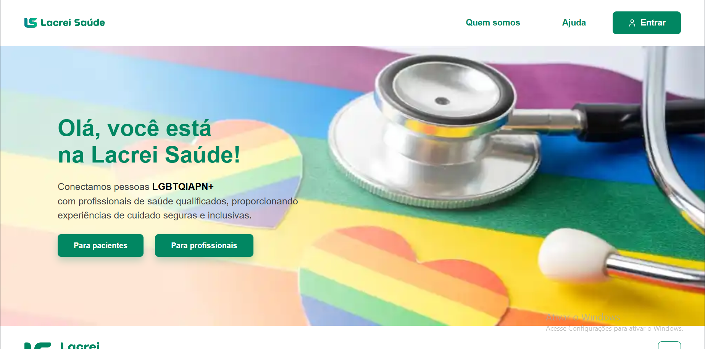
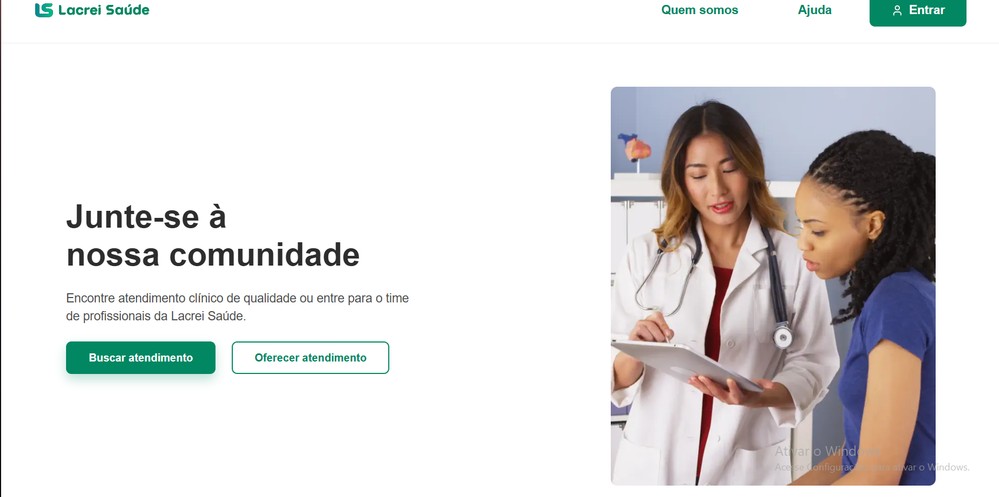
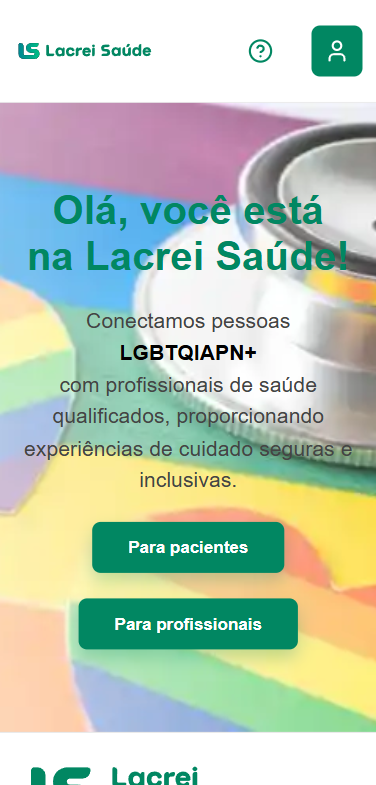

# Projeto Lacrei Saúde: Desafio Front End

Este repositório apresenta a construção de uma aplicação web utilizando **Next.js (App Router)** e **TypeScript**. O foco do desenvolvimento foi a fidelidade visual ao layout fornecido (Figma), componentização, roteamento e testes unitários.

Foram desenvolvidos componentes reutilizáveis (**Header**, **Footer** e **Button**) e páginas com navegação interna, mantendo responsividade e boas práticas de acessibilidade (atributos ARIA quando necessário).

---

## Demonstração e Acesso

O projeto está hospedado e pode ser acessado em:

**[Acessar Demonstração no Vercel](https://desafio-lacrei-saude-mu.vercel.app)**

---

## Tecnologias Utilizadas

* **Framework:** Next.js (App Router)
* **Linguagem:** TypeScript
* **Estilização:** Styled-Components
* **Testes:** Jest e React Testing Library
* **Ícones:** Lucide React

---

## Funcionalidades Implementadas

### 1. Header e Footer (Componentes Reutilizáveis)

O Header e o Footer foram implementados com Styled-Components para garantir reutilização, organização e consistência visual.

#### Header

* Logo clicável que redireciona para a **página inicial** (`/`).
* Botão **“Quem somos”** com roteamento interno para `/3l/QuemSomos`.
* Botão **“Ajuda”** com link externo para a página oficial de ajuda.
* Layout responsivo: Versão desktop e versão mobile com botões por ícone.

#### Footer

* Links institucionais.
* Ícones sociais com links externos (Facebook, Instagram, Linkedin e E-mail).
* Botão **“voltar ao topo”** (desktop e mobile).
* CNPJ exibido corretamente (sem duplicação no mobile).

### 2. Roteamento (App Router)

O projeto utiliza o sistema de rotas do Next.js baseado em pastas dentro de `src/app/pages`.

| Página | Rota |
| :--- | :--- |
| Página Inicial (Home) | `/` |
| Escolha da Pessoa | `/2l/EscolhaDaPessoa` |

### 3. Botões Reutilizáveis

Foi criado um componente **`Button`** reutilizável para padronizar os botões do projeto e facilitar a manutenção.

#### Variações

* `solid` (botão preenchido)
* `outline` (botão com borda)

O componente é utilizado nas páginas (ex.: Home e Escolha da Pessoa), mantendo o mesmo estilo visual em todo o sistema.

### 4. Acessibilidade (ARIA)

Foram aplicados atributos ARIA quando necessário para melhorar navegação e entendimento por leitores de tela:

* `aria-label` em botões ícone-only (ex.: ajuda e entrar no mobile).
* `aria-label` no link da logo para indicar “Voltar para a página inicial”.

---

## Demonstração

### Versão Desktop

* **Página Inicial (Home)** com hero, texto e botões de navegação.


* **Página Escolha da Pessoa** com layout de texto + imagem ao lado.



### Versão Mobile

* Header com botões reduzidos para ícones.


* Layout das páginas ajustado para empilhamento e alinhamento central.


* Footer adaptado com botão “voltar ao topo” e CNPJ na linha correta.


---

## Desempenho

### Análise no Lighthouse

* **Página Inicial (Home)** 


* **Página Escolha da Pessoa** 


---

##  Como Iniciar

### Instalação

1.  **Clone o repositório:**
    ```bash
    git clone https://github.com/sandyrodriguesjs/desafio-lacrei-saude.git
    ```
2.  **Instale as dependências:**
    ```bash
    npm install
    ```

3.  **Inicie o servidor:**

    Para iniciar o servidor de desenvolvimento:

    ```bash
    npm run dev
    ```
4.  **Acesse o projeto em:**

    ```bash
    http://localhost:3000
    ```

---

##  Testes Unitários
Para executar os testes unitários e verificar a cobertura:

```bash
npm test
```
---

## Cobertura de Testes Implementadas
Esta base inclui actuellement testes de unidade essenciais cobrindo Header, Footer e a página inicial.

- `src/app/components/Header/header.test.tsx`
    - Verifica que o `Header` é renderizado e que clicar no logo aciona navegação para `/`.

- `src/app/components/Footer/footer.test.tsx`
    - Verifica que o botão “Voltar ao topo” existe e que ao ser clicado chama `window.scrollTo` com `{ top: 0, behavior: "smooth" }`.

- `src/app/page.test.tsx`
    - Testa a página `Home` (renderização) e navegação: clicar nos botões `Para pacientes` e `Para profissionais` dispara `router.push("/2l/EscolhaDaPessoa")`.

Comandos úteis para execução:

```bash
npm test


npx jest src/app/components/Footer/footer.test.tsx


npx jest -t "Voltar ao topo da página"

npx jest --coverage
```
 --- 


 ## Comentários Sobre Escolhas Técnicas

 * **Styled-Components** foi escolhido para manter os estilos organizados por componente e facilitar a manutenção.
* **Componentização** (Header/Footer/Button) garante reutilização e consistência visual. 
* **React Testing Library** foi utilizada por testar o comportamento do componente do ponto de vista do usuário. 
* Uso de **rotas por pasta (App Router)** simplifica a estrutura e deixa o projeto mais alinhado com o padrão moderno do Next.js.
---

## Estratégia de Rollback (Vercel)

O projeto utiliza o **Vercel** como plataforma de deploy, que oferece suporte nativo a **rollback funcional** por meio de *Preview Deploys*.

 ### Rollback via Vercel
Em caso de falhas após um deploy em produção, o rollback pode ser realizado de forma simples:

1. Acessar o painel do projeto no Vercel.
2. Navegar até a aba **Deployments**.
3. Selecionar um **deploy anterior estável**.
4. Promovê-lo novamente para produção com um clique.


## Rollback via GitHub (Controle de Versão)

### Abordagem Recomendada — Reversão de Commit

Indicada quando um commit específico causou erro.

#### Passos:
```bash
git log --oneline
git revert <hash-do-commit>
git push origin main
```

---

### Abordagem Alternativa — Reset para Versão Estável

Indicada quando é necessário retornar o projeto a um estado anterior conhecido.


#### Passos:
```bash
git log --oneline
git reset --hard <hash-do-commit-estavel>
git push --force origin main
```

---


